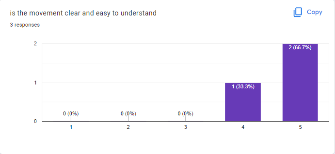

# 2.3.6.5 Cycle 6.5 Rendering Complex move orders.

## Design

One of the reasons why I wanted to move to using Complex Move Orders is because it would be beneficial to be able to render the exact path a ship would follow after being given a movement command.

Whilst developing the complex move orders I struggled with difficulties interpreting the Phaser 3 documentation for Paths. I decided that since I was struggling understanding the Path that was actually being generated by my function calls I needed a way to render and visualize it more easily so that I could debug the issues I faced.

Later this debugging method can be adapted into a piece of the game UI

### Objectives

The obective is quite simply to render the next move order in the queue and do this as quickly and easily as possible.

* [x] the next Complex move order in the queue renders
* [x] This doesn't interupt the operation of the game
* [x] This doesn't crash the game or cause errors

### Usability Features

Usability Features take a backseat here because this is currently purely a debugging tool. When/if I adapt it later this will be important

### Key Variables

| Variable Name | Use                                                                                                |
| ------------- | -------------------------------------------------------------------------------------------------- |
| Graphics      | A Phaser graphics object to render the complex move order with                                     |
| lineToDraw    | a temporary pointer to the next complex move order that can be used to call methods on that object |

### Pseudocode

```
//initialize graphics

update() {
    //clear graphics
    const lineToDraw = testship.moveOrderQueue.peek();
    //draw lineToDraw
}
```

## Development

since I'm calling a method on the moveOrderQeue which is returning a pointer to the complex move order I need to store that pointer so that I can call the method I need on the complex move order.

The Phaser Path class has a method which draws the path to a graphics object and since complex move orders inherit this I can use the .draw() method on them. I first initialize the graphics object; then store a pointer to the complex move order using moveOrderQueue.peek() then finally I call the .draw(graphics) method using that pointer to draw the complex move order to the graphics object.\
\
All that's missing is to clear the graphics object at the beginning of every update and to apply a fillstyle once the complex move order has been drawn to it (so that it renders properly).

### Outcome



<pre class="language-typescript" data-line-numbers><code class="lang-typescript">import 'phaser';
import './Ship';

const config = {
  key: "GameRun",
  // active: false,
  // visible: true,
  // pack: false,
  // cameras: null,
  // map: {},
  // physics: {},
  // loader: {},
  // plugins: false,
  // input: {}
};

let graphics: Phaser.GameObjects.Graphics;

create() {

		console.log('gameRun active');
		let shipName = "testship";
		this.shiplist.push(this.add[shipName](500, 500, "TestShipSpritesheet"));
		console.log(this.shiplist[0]);
		
		const point1 = new Phaser.Math.Vector2(200,200);
		const ang1 = -115;
		const point2 = new Phaser.Math.Vector2(400,100);
		const ang2 = 60;
		
		this.shiplist[0].NewPath(point1,ang1,point2,ang2);

		const point3 = new Phaser.Math.Vector2(400,100);
		const ang3 = 60;
		const point4 = new Phaser.Math.Vector2(700,50);
		const ang4 = 60;

		this.shiplist[0].NewPath(point3,ang3,point4,ang4);

		const path3Point1 = new Phaser.Math.Vector2(900,800);
		const path3Ang1 = 70;
		const path3Point2 = new Phaser.Math.Vector2(300,400);
		const path3Ang2 = -80;

		this.shiplist[0].NewPath(path3Point1,path3Ang1,path3Point2,path3Ang2);

		graphics = this.add.graphics();
		console.log(this);
	}

<strong>update() {
</strong>		graphics.clear();

		graphics.lineStyle(2, 0xffffff, 1);

		if (!this.shiplist[0].moveOrderQueue.isEmpty) {
			const lineToDraw = this.shiplist[0].moveOrderQueue.peek();
			lineToDraw.draw(graphics);
		}
		graphics.fillStyle(0xff0000, 1);
	}
</code></pre>




```typescript
import 'phaser';
import GameConfig from './config';
import LoadingScene from './LoadingScene';
import MenuScene from './MenuScene';
import ControlsScene from './ControlsScene';
import GameRun from './GameRun';

class Game extends Phaser.Game {
	constructor(GameConfig) {
		super(GameConfig);
		//add scenes
		this.scene.add('Loading', LoadingScene);
		this.scene.add('Menu', MenuScene);
		this.scene.add('Controls', ControlsScene);
		this.scene.add('GameRun', GameRun);

		//start loading the game
		this.scene.start('Loading');
	}
}

let game = new Game(GameConfig);
let shiplist = [];
```





### Challenges

It was proving a bit challenging to understand how I should aquire a pointer to the testship from the GameRun Scene scope so I decided to create a global list of ships called "shiplist" this is initialized in the game.ts file which essentially serves as my "index" file. Eventually this can be adapted/used to help facilitate other game features.

## Testing

The tests for this are quite simple. I can test for my cycle objectives directly by running the code and visually identifying the move order

### Tests

| Test | Instructions     | What I expect                                                                | What actually happens                             | Pass/Fail |
| ---- | ---------------- | ---------------------------------------------------------------------------- | ------------------------------------------------- | --------- |
| 1    | Run code         | Game doesn't freeze/crash or throw errors before reaching the end of content | The game runs without throwing errors or freezing | Pass      |
| 2    | Press Start Game | TestShip appears and now the Complex Move Order is rendered visibly          | As expected                                       | Pass      |

### Evidence

as seen the move order now renders visibly.

<figure><figcaption></figcaption></figure>
