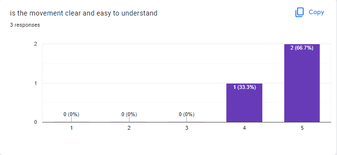

# 2.3.8 Cycle 8 transverse move orders

## Design

The aim of this Cycle is to ensure that every possible movement works for the ship. Currently the case where the tangent between the two turning circles is transverse that I mentioned before breaks the movement. This should be fixed by rotating the translation that I'm generating to represent the tangent in this case so that it reflects the actual transverse tangent instead of a completly incorrect direct tangent

### Objectives

* [x] Transverse turns no longer break the move path constructor
* [x] ~~I can finally put constructing complex move orders behind me~~

### Usability Features

.png>)

### Key Variables

| Variable Name | Use                                                                                                                                   |
| ------------- | ------------------------------------------------------------------------------------------------------------------------------------- |
| RotateAngle   | the angle to rotate the striaght transformation section by, this needs to be done to change the tangent from a direct to a transverse |

### Pseudocode

```
MovePath {
    constructor() {
        if (//turn one is right) {
            if (turn two is right) {
                //modifications for right direct turn
            } 
            else {
                //modifications for transverse turn with first turn right
            } 
        }
        else {
            if (turn two is right) {
                //modifications for transverse turn with first turn left
            }
            else {
                //modifications for direct right turn
            }
        }
    }

}
```

## Development

<figure><figcaption></figcaption></figure>

this shows the basis for the mathematical and theory side. I'm going to use basic trig to find the angle of the vector and pythagoras to find the magnitude, then I'll construct a vector using that magnitude and angle. I'm going to use Phaser's vector2 methods for this to save me some work.

### Outcome

it is done

<pre class="language-typescript" data-line-numbers><code class="lang-typescript">import 'phaser';

class Queue {
	
	private elements = {};
	private head = 0;
	private tail = 0;

	enqueue(element) {
		this.elements[this.tail] = element;
		this.tail++;
	}
	dequeue() {
		const item = this.elements[this.head];
		this.elements[this.head].destroy();
		delete this.elements[this.head];
		this.head++;
		return item;
	}
	peek() {
		return this.elements[this.head];
	}
	get length() {
		return this.tail - this.head;
	}
	get isEmpty() {
		return this.length === 0;
	}
}

class MovePath extends Phaser.Curves.Path {

	constructor(point1: Phaser.Math.Vector2, ang1: number, point2: Phaser.Math.Vector2, ang2: number, TurnR: number) {
		//call the constructor from the Path class
		super(point1.x,point1.y);
		
		//find the angle between the two points
		const travelAngle: number = Phaser.Math.Angle.BetweenPoints(point1, point2) * (180/Math.PI);
		//find turn directions

		//if ang1-travelAngle &#x3C; 0 clockwise
		let turn1Clockwise: boolean = (ang1 - travelAngle &#x3C; 0 &#x26;&#x26; ang1 - travelAngle > -180);
		//if travelAngle-ang2 &#x3C; 0 clockwise
		const turn2Clockwise: boolean = (travelAngle - ang2 &#x3C; 0 &#x26;&#x26; travelAngle - ang2 > -180);

		//assigns the first turning circle center to point1 and the transformation from original point1 to the first turning circle center in CenterTranslation1
		const CenterTranslation1 = MovePath.FindTurningCircle(point1,ang1,TurnR,turn1Clockwise);	
		
		
		//assigns the second turning circle center to point2 and the transformation from original point2 to the second turning circle center in CenterTranslation2
		const CenterTranslation2 = MovePath.FindTurningCircle(point2,ang2,TurnR,turn2Clockwise);
		
		//find the translation between the two circle centers (point1 and point2)
		

		const interCenterTranslation = point2.clone();
		interCenterTranslation.subtract(point1);
		

		let rotation1 = 0
		let rotation2 = 0

		if (turn1Clockwise) {
			if (!turn2Clockwise) {
<strong>				//transverse with a right first turn
</strong><strong>				rotation2 = 180;
</strong><strong>				const length = interCenterTranslation.length();
</strong><strong>				const angle = Math.atan((2*TurnR)/length);
</strong><strong>
</strong><strong>				interCenterTranslation.rotate(angle);
</strong><strong>				interCenterTranslation.scale(Math.cos(angle));
</strong>			}
		}
		else {
			if (turn2Clockwise) {
<strong>				//transverse with a left first turn
</strong><strong>				rotation1 = 180;
</strong><strong>				const length = interCenterTranslation.length();
</strong><strong>				const angle = Math.atan((2*TurnR)/length);
</strong><strong>
</strong><strong>				interCenterTranslation.rotate(-angle);
</strong><strong>				interCenterTranslation.scale(Math.cos(angle));
</strong>			}
			else {
				rotation1 = 180;
				rotation2 = 180;
			}
		}


		const TransitionRadiusAngle = interCenterTranslation.angle() * (180 / Math.PI) - 90;

		

		this.ellipseTo(TurnR, TurnR, ang1 - 90, TransitionRadiusAngle, !turn1Clockwise, rotation1);


		//create the straight section between the two turns
		const StraightTranslation = interCenterTranslation.clone();
		StraightTranslation.add(this.getEndPoint());
		this.lineTo(StraightTranslation);

		//create the second elipse curve representing turn2

		
		this.ellipseTo(TurnR, TurnR, TransitionRadiusAngle, ang2 - 90, !turn2Clockwise, rotation2);
		

		console.log(this.getEndPoint());
	}//phaser.math.angle.BetweenPoints(interCenterTranslation,)

	//determines the location of a turning circle
	static FindTurningCircle(point: Phaser.Math.Vector2, ang: number, TurnR: number, TurnDir: boolean) {
		
		const Translation = new Phaser.Math.Vector2(TurnR,0);
		
		const tempAngle = (TurnDir ? ang + 90 : ang - 90)*(Math.PI/180);
		
		Translation.setAngle(tempAngle);
		
		point.add(Translation);
		
		return Translation;
	}

	getPointDistance(d: number) {
		let outPoint = new Phaser.Math.Vector2();
		let outDirection = new Phaser.Math.Vector2();

        const curveLengths = this.getCurveLengths();
        let i = 0;

        while (i &#x3C; curveLengths.length)
        {
            if (curveLengths[i] >= d)
            {
                var diff = curveLengths[i] - d;
                var curve = this.curves[i];

                var segmentLength = curve.getLength();
                var u = (segmentLength === 0) ? 0 : 1 - diff / segmentLength;

				return [curve.getPointAt(u, outPoint), curve.getTangentAt(u, outDirection)];
            }

            i++;
        }

        // loop where sum != 0, sum > d , sum+1 &#x3C;d
        return null;
	}

}

export default class Ship extends Phaser.GameObjects.Sprite {

	public velocity = 0;
	public accelTime = 0;
	public limit = 0; //(Math.E-1)/this.accelcoef
	public maxV = 0;
	public accelCoef = 0;
	public moveOrderQueue = new Queue();
	public TurnR = 0;
	public TempDistance: number = 0;

	constructor(scene: Phaser.Scene, x: number, y: number, texture: string, frame?: string | number ) {
		super(scene, x, y, texture, frame);
		return Object.assign(this, scene.cache.json.get('TestShipJSON'));
	}

	Accelerate(): number{
		return this.velocity = this.maxV*(Math.E*Math.log1p(this.accelCoef*this.accelTime)-this.accelCoef*this.accelTime);
	}	// velocity = v*(e*Math.log1p(a*x)-a*x)

	UpdateAccelTime(acc: boolean, delta: number): void {
		
		let incTime: number;

		if (acc) {
			incTime = this.accelTime + delta/1000;
		} 
		else {
			incTime = this.accelTime - delta/1000;
		}

		if (incTime &#x3C; this.limit &#x26;&#x26; incTime > 0) {
			this.accelTime = incTime;
		}
	}

	Move(delta: number): void {
		if (this.moveOrderQueue.isEmpty) return;
		const moveOrder = this.moveOrderQueue.peek();
		this.UpdateAccelTime(true,delta);
		this.TempDistance = this.TempDistance + this.Accelerate() * (delta/1000);
		const commands = moveOrder.getPointDistance(this.TempDistance);
		if (!commands) {
			this.moveOrderQueue.dequeue();
			this.TempDistance = 0
			console.log("current coordinates");
			console.log(this.x);
			console.log(this.y);
			this.Move(delta);
			return;
		}

		this.x = commands[0].x;
		this.y = commands[0].y;
		
		this.setRotation(commands[1].angle()+Math.PI/2);
	}
	NewPath(point1, ang1, point2, ang2): void{
		const PendingOrder = new MovePath(point1,ang1,point2,ang2,this.TurnR)
		let drawnPath = new Phaser.GameObjects.Graphics(this.scene);
		drawnPath.lineStyle(5, 0xFF00FF, 1.0);
		PendingOrder.draw(drawnPath);
		this.moveOrderQueue.enqueue(PendingOrder);
	}
	update(time, delta) {
		this.Move(delta);
	}
}

Phaser.GameObjects.GameObjectFactory.register('testship', function (this: Phaser.GameObjects.GameObjectFactory, x, y, key, frame) {
		console.log("making testship");
		const testship = new Ship(this.scene, x, y, key, frame);
		testship.setOrigin(0.5, 0.5);
		testship.setScale(0.2);
		console.log(testship);
		this.displayList.add(testship);
		this.updateList.add(testship);
		this.scene.events.on('update', testship.update, testship);
		return testship;
});
</code></pre>

### Challenges

This was quite simple but in the end I decided to change the maths slightly to simplify it. As you can see in the code I generate the translation between circle centers at line 56 and then modify the inputs to the ellipseTo method by changing variables between lines 63 and 88 in the 3 other possible cases than right direct.

## Testing

I tested using hard coded inputs again, outputing the end of the generated move path and seeing if they lined up and the move path/movement looked natural.

### Tests

| Test | Instructions              | What I expect                                                                 | What actually happens                             | Pass/Fail |
| ---- | ------------------------- | ----------------------------------------------------------------------------- | ------------------------------------------------- | --------- |
| 1    | Run code                  | Game doesn't freeze/crash or throw errors before reaching the end of content  | The game runs without throwing errors or freezing | Pass      |
| 2    | Press Start Game          | Test ship appears and follows the first move path (transverse left turn)      | As expected                                       | Pass      |
| 3    | wait for second move path | Test ship follows move path 2 (transverse right) after completing move path 1 | As expected                                       | pass      |
| 4    | wait for third move path  | Test ship follows move path 3 after completing move path 2                    | The Test ship ends up at the wrong coordinates    | fail      |

### Evidence



### Conclusions

The third move path showed that transverse move orders don't work when the move order would have the ship end up very close to its original position. I need to consider this when going forward
